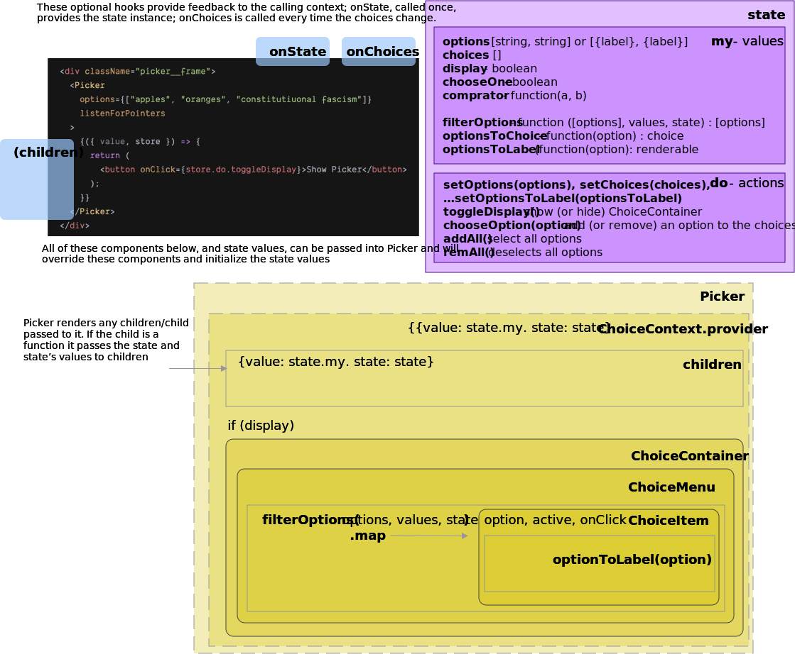

# @wonderland-labs/React-Picker

Wonderland Labs' React Picker is a "multi choice management system" 
in the spirit of `react-table`; it allows 
you to pick the visual display of the container, wrapper, and items however you want, 
and gives you access to the store and its'  current value through context. 

(note - there is a react-picker component owned by another developer; no relation to this)

# What you get here that you don't get from any number of other alternatives

## Complete freedom of design

Every part of the architecture can be switched out for substitutes giving you 100% control
over the pickers' look and feel. You can put options in lists, rows, buttons, an SVG 
or whatever display style you want. 

The components used to style the picker are injected into the root, so you can
override any or all of them to tune the display to your application. 

## A unified model

You don't have to design different systems for checkboxes, radios, dropdowns or lists; the features
that make these systems unique are simply options (chooseOne for radio)

## The ability to intercept choice changes before they get to the UI 

Instead of reacting to changes in the selection after the fact you can intercept changes in selection 
and curate them before the UX changes. so for instance, if you have a maximum number of choices, you
can enforce that and revert to the previous set of choices when too many options are chosen. 

## The ability to translate any input into choices and/or options at a functional level

Instead of having to constantly parse your data before submitting it to the picker, you can embed
translation functions into the picker themselves to interpret any data you want into usable choices. 

* the `optionToLabel(option)` hook translates any given option into a visible label. 
* the `filterOptions(options)` hook allows you to reorder or otherwise filter the options
  from the store before they are displayed. (for instance, you can filter out chosen options)
* the `choiceToOption(choice)` determines how a choice is stored in the choices collection when an option
  is selected
* the `comprator` option compares a given choice with an option to determine whether an option is active

By tweaking these functions you can translate options into reduced choices and ensure that choices and options
can be whatever format you need them to be. 

## Full and direct access to the controlling store that manages the picker

The low-level store that controls selection is exposed so that you can monitor it and do whatever operations
you want on the fly -- update the options, close or open the picker from the outside, and monitor it for
changes in values.

# The structure of react-picker

Demos can be found at [CodeSandbox](https://codesandbox.io/s/react-picker-demo-hos1o?file=/src/App.js)



React picker is a combination of tags to display choices governed by a store that is
provided as a context. 

## Nested Components and Functionality

The Picker component itself initializes the state; it displays any
children provided to it, then the menu, if display is set to true. 

### ChoiceContainer

ChoiceContainer determines which options are active (in choices)
and renders a map of them as ChoiceOptions, surrounded by ChoiceMenu. As it is a "middleware" component
between the store and choiceMenu/ChoiceItem, it's probably best to leave it alone.

### ChoiceMenu

A thin wrapper that surrounds the options with a div of class "picker__container".
It can be injected if other UI is needed to display only when the options are, such as a selectAll
box or navigation. 

ChoiceMenu wraps it children ChoiceItems in a dom container. The raw options list is passed in
via the displayedOptions property, so if you want a more elaborate visual arrangement of items,
you can either parse the children property (which are ChoiceItem instances) or recreate the 
inner content of ChoiceContainer inside ChoiceMenu and ignore the children property. 

### ChoiceItem

a menuItem; it recieves option, state and active as properties,
and `optionToLabel(option)` as its children (child). It's passed `chooseOption(option)` as its onClick. 

The stock ChoiceItem container uses built in SVG icons for radio and select-style displays. 
If you want to use another set of icons/containers to indicate active state, pass them in 
via the iconOn and iconOff properties. 

**Sub-components**

The ChoiceItem is injected with two optional pass-through components: ChoiceIcon and ChoiceLabel. 
Both of these can accept properties `active` and `disabled` and ChoiceLabel expects children to be provided
-- the value of optionToLabel(option). In the absence of these optional containers, 

### EmptyMessage

an optional component that displays when no options are available -- options are absent or an empty array.
In the absence of this component a tag displays "no choices" in this situation.

Options can be "empty" if the optionsFilter eliminates all options -- or, for instance,
if the options are loading asynchroously. 

## The Picker Store

The picker store is an instance of Looking Glass Engine; it has the following 

### Values

the following values are available from the store's `my` property,
and are the values of the `value` object in context.

```
store.my.options {[string/Object]} -- either strings, or objects with a label property
store.my.choices {[same types as options]} -- the selected items from options
store.my.display {boolean} whether to show the options container
store.my.chooseOne {boolean} if true, your choices are singlular ("radio button mode")
store.my.comprator {function} determines if a choice is equivalent to a given option. 
store.my.filterOptions {function} returns options in a new array
store.my.optionsToChoice {function} converts an option to a storeable choice
store.my.optionsToLabel {function} converts an option to a displayable entity
store.my.closeOnClick {boolean} if true, close when the user clicks outside the ChoiceContainer
```

each `my` item has a pass-through function -- `do.setOptions`, `do.setChoices`, etc. 

### a word on filterOptions

all options pass through filterOptions before they are displayed. By default, it 
returns the options as stored. You can define filterOptions to:
 
* sort the options alphabetically
* respond to autocomplete
* float selected options to the top (or out). 
* enable pagination or deep-filtering with external selection

The filterOptions doesn't actually change the stored options *or* the stored chosen items.
It is purely a display mechanic. *do not mutate the options themselves* 
inside the filterOptions.

### choices and options

by default selected options are stored as choices. 
> An option is active when one (or more) value in the choices is matches that option. 

The language here is important. *matches* is determined by the comparator -- by default, `lodash.isEqual`.
So for instance, if you store an object, `{id: 100, name: 'Bob'}` in the choices and
have a different object in the options list, `{name: 'Bob', id: 100}`, the default comparator
will flag that option as active. 

#### getting tricky with optionToChoice

In some scenarios you may want to store choices in a format different from the options. 

if you want for instance you can store the id of an options as a choice. 

Say you have this as options: 

```
[
  {id: 1, name: 'Bob'},
  {id: 2, name: 'Sue'},
  {id: 3, name: 'Thuy'},
  {id: 4, name: 'Mohammed'}
]

```

you might want the choices to be a list of the ids - so you set the optionToChoice to:

```
({id}) => id
```

then if you click on the first two options choice becomes:

```
[1, 2] 
```

when optionsToChoice is not the identity function, then:

> An option is active when for one of the choices,
> store.my.comparator(choice, store.my.optionsToChoice(option)) is true.

## Actions

Actions are methods available from the store that enable changes of the store's content. 

```
store.do.set[myProperty](value) ... setter for each property of the store (my).
store.do.toggleDisplay() show (or hide) the options
store.do.chooseOption(option) add (or remove) an option to the choices*
store.do.addAll(store) select all options
store.do.remAll(store) select no options/clear choices
* if chooseOne is true, chooseOption sets the choices to an array containing the new option (only).
```

None of these actions has useful return values; their function is to 
update the state, like a redux action. 

# the Picker Component

The Picker component displays options passed in through its options property,
via the Container, and whatever you put in as its children property; children
have access to a unique Store instance (see above) and its values, via the ChoiceContext. 

The following are the primary properties. 

* **chooseOne**: whether the list operates like a radio button set
   (only one option at a time) or multiSelect.
* **options**: an array of strings or objects with label properties. 
* **display**: boolean - whether to display the options initially. 

These properties replace the default containers used to render the Picker. 
All of them are optional, and have workable default stand-ins if not provided:

* **ChoiceContainer**: A container that is passed Item(ChoiceItem) and ChoiceMenu
   and is expected to pull value/state out of context and render the menu
   if display is true.
* **ChoiceItem**: A container that is passed option, active, store, onClick,
   and (as the children} the label  and renders an option in the menu
* **ChoiceMenu**: A container that wraps the options inside ChoiceContainer
   to provide an opportunity for adding selectAll, navigation etc. around
   the options (that are passed in as children).
* **children**: the trigger to display (if any), above the ChoiceContainer. 
  Use ChoiceContext to attach store.my.toggleDisplay to this to an onClick listener
   to trigger display of the menu on click.
* **ChoiceItemIcon** An optional container that renders the icon (checkbox, radio)  
  inside the ChoiceItem. Accepts `active`, `chooseOne` boolean properties. 
  If absent, a set of SVG items for radio/checkboxes are provided. 
* **ChoiceItemLabel** An optional container that wraps the result of optionToLabel
  in a container; if absent the label will be wrapped in a `<label />` tag. 
  
These callbacks return useful values from the picker:
   
* **onChoices([choices])**: a listener that gets the current choice set every time it changes
* **onStore(store)**: a callback that is passed the store on initialization to allow for
   modification of the store or access to it from outside the picker
   
These functions alter the behavior of the Picker:

* **comparator(choiceA, choiceB)**: a function that compares two choices to determine if they are equivalent. 
  It is used to compare options -- as filtered by optionToChoice -- to a single item in the choices collection. 
  If the two choices are considered a match, returns true. 
* **optionToLabel**: converts an option to a displayable string or dom node set inside ChoiceItem. 
* **filterOptions(options, values, state)**: a function that takes the entire options set as an array and returns
   the options, potentially in a different order or filtered through autoseelect.
* **optionToChoice(option)**: if you want to store choices in a format different from the options, 
   for instance, by ID, define this function. 
  If absent, tries to clone objects, or returns options as is.
* **optionToLabel(option)**: a function to make the option displayable as a label. 
  If absent tries to extract some reasonable field guesses from objects (label,name,title...) or returns option as is. 
* **optionDisabled(option):boolean**: a function that sets the disabled property of ChoiceItem

## Creating a root trigger

The launch of the options has to be triggered by an event of the content of the picker:

```jsx

<Picker options={['Meat', 'Cheese', 'Milk', 'Plutonium']} chooseOne closeOnClick>
{({value, store}) => (
  <button onClick={store.do.toggleDisplay}>Choose Radio Style!</button>
)}
</Picker>

```
Alternately if `Picker display` is true, the options will be displayed initially

## Dropdown behavior

By default the picker DOES NOT implement dropdown ux. The choices when displayed appear inside the menu 
container as a vertical list. If you want the choices to drop down, wrap the picker with an element
whose css `position: relative` value has been set and style the picker with these or similar 
qualities. Width, sizing, and padding should be adjusted to taste. 

```css
// applies to the menu wrapper when display is true. 
.picker__container {
  display: block;
  min-width: 30rem;
  background: white;
  text-align: left;
  color: black;
  font-size: 1.5rem;
  padding: 0.5rem 1rem;
  border: 1px solid black;
  position: absolute;
  left: 0;
  top: 0;
}

```

## Identity in the Picker Component choice vs options

An option is considered chosen when one of the choices is `equal` to it. (or,
how it appears after passing through optionToChoice, if set.) It uses
the `comparator` property of Picker, if passed to compare a choice to 
the option; by default, equal to `lodash.isequal`. 

If you want a more specific comparator, such as comparing options' ID properties,
update the comparator.

## The Pick

There are **NO** form elements by default; picker items are passed these properties:
 
 * active, a boolean property that indicates whether or not the option is in the choice collection
 * children -- the display text that identifies the item; can be a complex HTML item or a simple string
 
 ...and when the item is clicked then active toggles. The item is responsible for 
 changing its appearance based on the active property; the default ChoiceItem 
 shows an SVG Checkbox checked when an item is selected but any other css style you 
 want to use to effect a selection indicator is fine. 
 
 note - the click handler and active passthrough are accomplished via the ChoiceContainer; if 
 you have your own container, you have to accomplish these actions yourself. 

## Customizing ChoiceItem

you can define how items look by passing a component to the picker named `ChoiceItem`; it 
is passed 
* onClick - a handler that toggles the options' inclusion in the choices array
* option
* children (the option's label, or itself if it's a string)
* active

If you want to manage selection you can put your own onClick receiver in your ChoiceItem
component; just cancel the event's propagation to avoid triggering the outer onClick handler. 

The CheckOn/CheckOff icons that ChoiceItem provides by default are easily replaceable
by a custom containers' UI. 

One note: the ChoiceItem selection motif is button-style - it reacts to clicking (anywhwere) 
and doesn't directly interact with form item checked value or check / select change state

## Customizing ChoiceContainer

ChoiceContainer is a "middleware" container that should in most use cases not be modifed;
modifying ChoiceMenu and Item should provide all the utility you need to customize your picker
in most scenarios. 

If you simply must change how the `ChoiceContainer` operates you can override it as a 
property of Picker. Keep in mind you'll have to clone or in some other way affect the 
operation of the stock ChoiceContainer, displaying the options and hooking onClick
to the stores' `chooseOption` action. 

ChoiceContainer is not a dropdown by default -- it's a "Push down" that appears below
the children when its activated by setting display to true. You can change that by 
defining the css qualities of the `.picker__container` css class. 

# ChoiceContext 

The store, and its values, are provided/updated through a context: `ChoiceContext`. 
This is a standard React Context that provides an object: 

```
{
   value: {Object}
   store: {LGE Store}
}
```

value is a clone of `store.my`; see above for a catalog of its properties. 
The store is instantiated in the Picker tag; so, if for some reason you nest Picker tags, 
the store should be consistent with the innermost occurance of Picker. 

## Disabling an Option

Disabling an option means you pass `disabled` to the ChoiceItem -- which (should) prevent the onClick from being fired
for that particular option. disabling does **NOT:**

*  prevent the option from being included as a choice
*  affect how the toggle, addAll, remAll methods behave

To do that you have to add a listener to the stores' 

## Curating Choices and Options

Choices and Options are stored internally in a Looking Glass Engine stream;
these streams can be accessed in `myStore.streams.get('choices')` and `myStore.streams.get('options')`
respectively. https://www.npmjs.com/package/@wonderlandlabs/looking-glass-engine documents all the things you
can do with the options and choices stream. Here is one example - 
you can call `myStore.streams.get('choices').preprocesws((newChoices) => {// ... redurn other choices});`
to alter, when choices are updated, which choices actually land. 
The demo folder has one example of this in action. 

The options stream can also be preprocessed to remove duplicates or badly formed options, sort them, 
or perform whatever other sanitization option you may want. 

Options are updateable on-the-fly; is is possible to update and change the options 
at any point by updating the options property of a Picker tag. 
